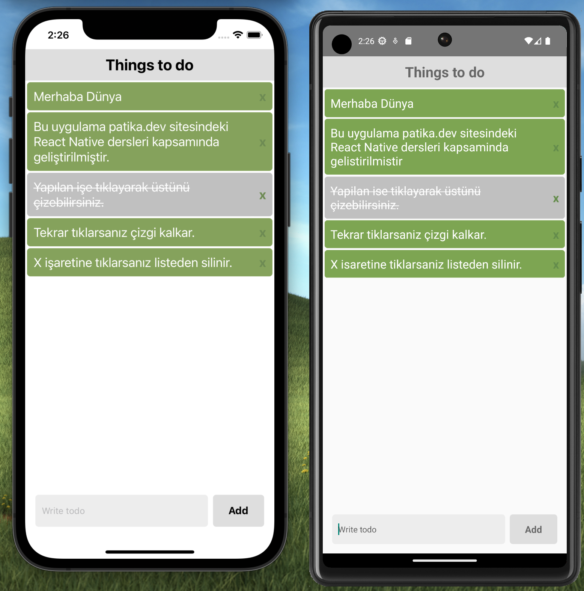

#Todo Application

Patika.dev sitesinin React Native dersleri kapsamında verdiği ödevlerden biri olan Todo App uygulamasının çalışır halidir. Aşağıda gördüğünüz ekran görüntüleri Android ve iOS sanal cihazlarına ait ekran görüntüleridir.

Ödevin linki : https://academy.patika.dev/tr/courses/react-native/odev_2

Yeni todo ekleme, eklenen todoyu silme ve yapılan işin üzerini çizme özellikleri vardır. 

Todoları AsyncStorage kullanarak saklamaktadır.

